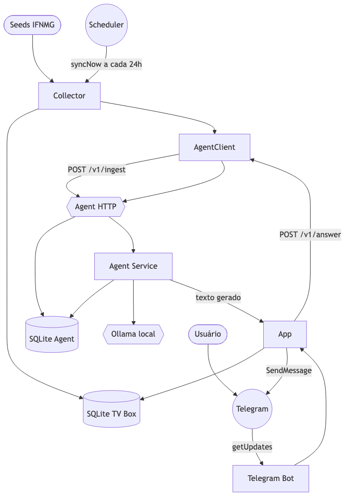
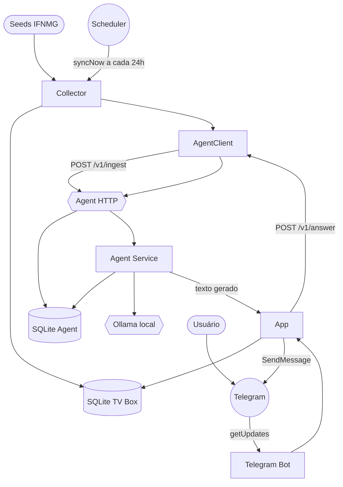

# Architecture

EditalBox é um monorepo dividido em dois componentes que colaboram por HTTP dentro da rede local:

- **`tvbox/` (Go)** — o nó principal, desenhado para rodar em uma TV Box com Armbian. Faz a coleta dirigida das páginas do IFNMG, extrai editais com tolerância a mudanças de HTML, persiste tudo em SQLite local e responde consultas simples (comandos via Telegram + busca textual). É leve de propósito: Go + SQLite + parsing local, sem dependências de nuvem.
- **`agent/` (Python)** — o nó auxiliar de processamento. Recebe os editais novos/alterados do tvbox, indexa por chunks, ranqueia consultas por sobreposição de tokens (com expansão por sinônimos) e, se houver um modelo Ollama local, gera a resposta em linguagem natural tendo como única fonte os candidatos locais.

A separação atende ao requisito de manter o nó de coleta enxuto (baixo consumo na TV Box) enquanto a "interpretação" roda onde há mais capacidade.

## Components

- **Collector** — varre páginas a partir de seeds configuradas, extrai título/conteúdo/datas/documentos e normaliza URLs. Veja [`modules/tvbox-internal-collector.md`](modules/tvbox-internal-collector.md).
- **Store (tvbox)** — SQLite local da TV Box: `notices`, `notice_documents`, `notice_events`, `sync_runs`, `telegram_sessions`, `telegram_messages`. Veja [`modules/tvbox-internal-storage.md`](modules/tvbox-internal-storage.md).
- **App (tvbox)** — orquestra tudo: scheduler de sync periódico, servidor HTTP (`/health`, `/sync`), polling do Telegram e roteamento de consultas para o agente. Veja [`modules/tvbox-internal-app.md`](modules/tvbox-internal-app.md).
- **Agent Client (tvbox)** — cliente HTTP que empurra editais alterados (`/v1/ingest`) e pede respostas (`/v1/answer`). Veja [`modules/tvbox-internal-agent.md`](modules/tvbox-internal-agent.md).
- **Agent Service (Python)** — núcleo do nó auxiliar: ingere, ranqueia e gera resposta. Veja [`modules/agent-src-agent-service.md`](modules/agent-src-agent-service.md).
- **Agent Store (Python)** — índice local do agente (`indexed_notices`, `indexed_chunks`). Veja [`modules/agent-src-agent-store.md`](modules/agent-src-agent-store.md).
- **Ollama Client** — ponte para o modelo local. Veja [`modules/agent-src-agent-ollama.md`](modules/agent-src-agent-ollama.md).

## System Diagram

## Data Flow

1. **Coleta** — o `Scheduler` dispara `syncNow`, que faz BFS a partir das seeds usando o `Collector` ([`tvbox/internal/app/app.go`](tvbox/internal/app/app.go), [`tvbox/internal/collector/collector.go`](tvbox/internal/collector/collector.go)).
2. **Persistência + push** — cada página vira um `Notice` upsertado no `Store`; os editais alterados desde o último sync são enviados ao agente via `pushChangedNotices` ([`tvbox/internal/app/app.go`](tvbox/internal/app/app.go)).
3. **Indexação** — o agente recebe em `/v1/ingest`, transforma cada edital em chunks de ~900 chars e indexa keywords ([`agent/src/agent/store.py`](agent/src/agent/store.py), [`agent/src/agent/main.py`](agent/src/agent/main.py)).
4. **Consulta** — o usuário manda mensagem no Telegram; o `App` monta um pool de candidatos (busca textual + recentes) e chama `/v1/answer` ([`tvbox/internal/app/app.go`](tvbox/internal/app/app.go)).
5. **Resposta** — o `AgentService` ranqueia por sinônimos e, se o Ollama estiver pronto, gera texto em LN; o `App` devolve ao Telegram ([`agent/src/agent/service.py`](agent/src/agent/service.py)).

## Key Design Decisions

- **URL canônica como chave de deduplicação** — `notices.canonical_url` é `UNIQUE`; o upsert incrementa em vez de duplicar.
- **Status derivado, não confiado** — `deriveStatus` infere `open`/`registration_closed`/`in_progress`/`finalized` a partir de datas extraídas e palavras-chave, tolerando variações de texto.
- **Busca textual ranqueada em vez de full-text search** — o tvbox pontua candidatos por tokens (título +8, excerpt +4, corpo +2), com stopwords PT; o agente faz o mesmo sobre chunks indexados.
- **Geração grounding-only** — o Ollama recebe apenas os candidatos selecionados; `looks_safe` descarta respostas suspeitas (ex.: presença de CJK). Evita alucinação fora da base.
- **Resiliência do polling** — o cliente Telegram usa backoff exponencial (`2s * 2^attempt`) e só retenta erros não relacionados ao cancelamento de contexto.
