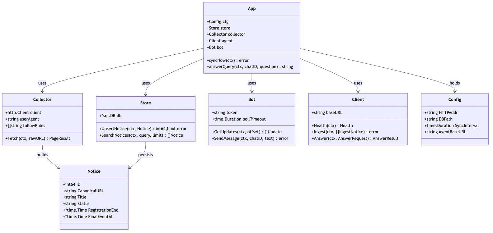
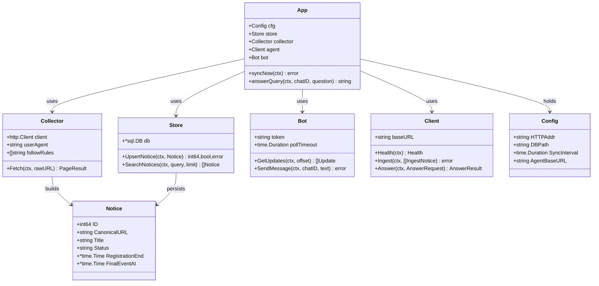
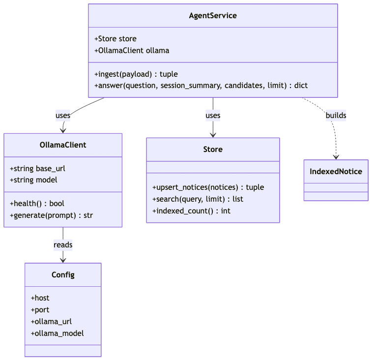
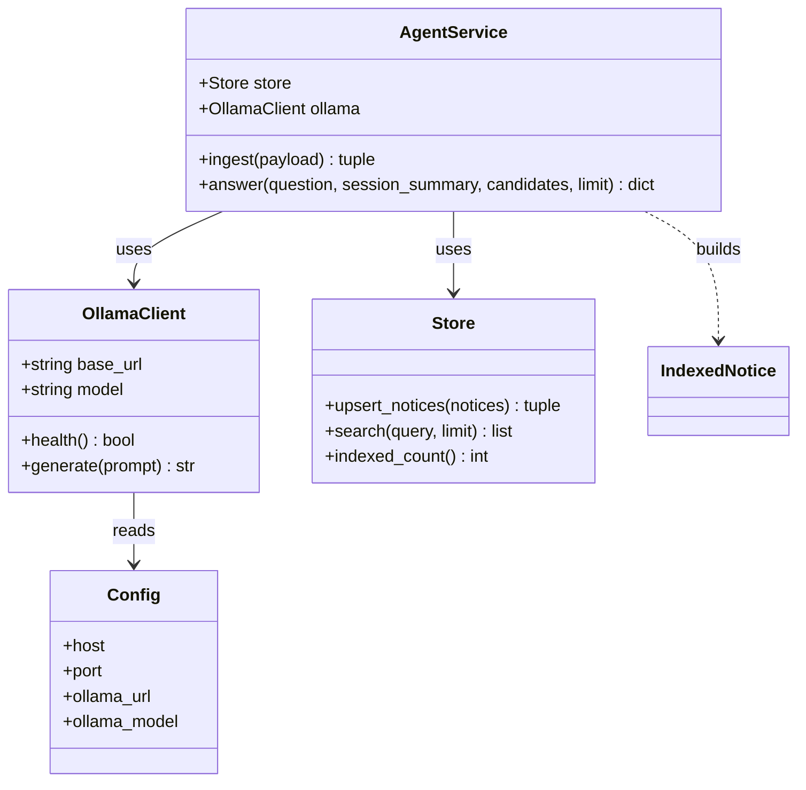

# Class Diagram

## Core Types (tvbox, Go)

## Core Types (agent, Python)

## Notes

- O tvbox e o agent são processos separados; a única relação real é HTTP (`Client` → rotas do agente). Os diagramas acima mostram os grafos internos de cada lado.
- `Notice`/`IndexedNotice` são DTOs quase idênticos — o tvbox os serializa para o agente via `CandidateAnswer`/`IngestNotice`.
- Não há herança relevante; o estilo é composição + structs planas (Go) e dataclasses (Python).
