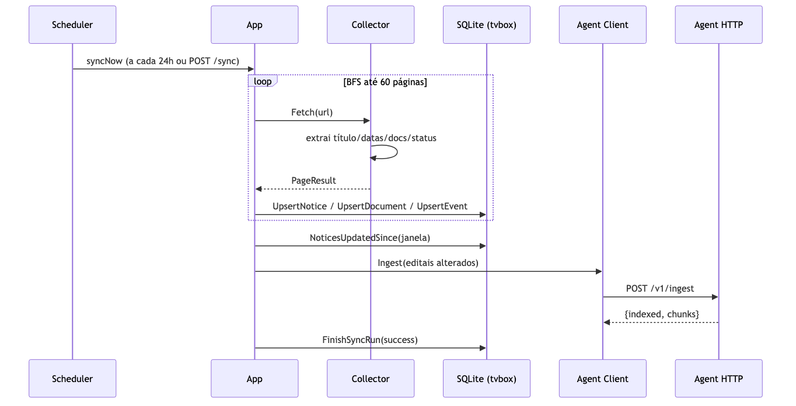
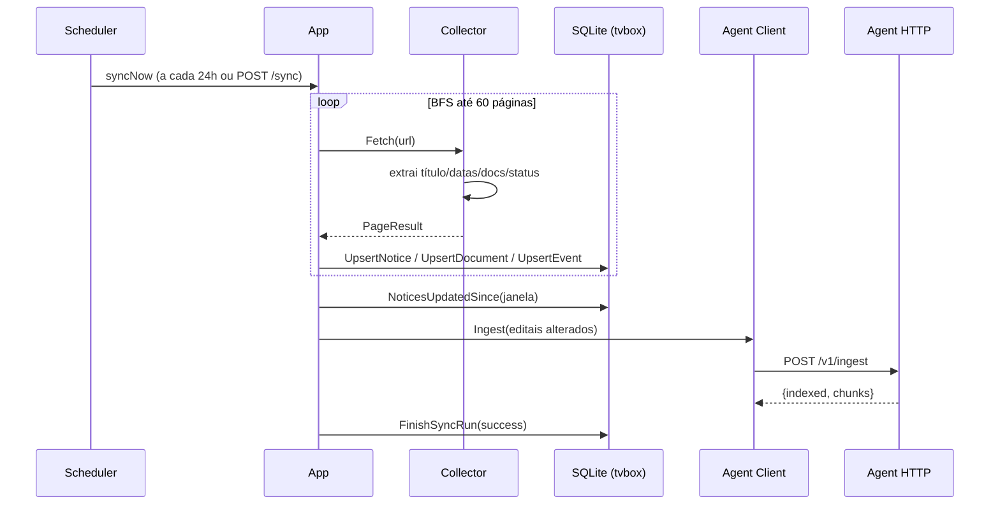
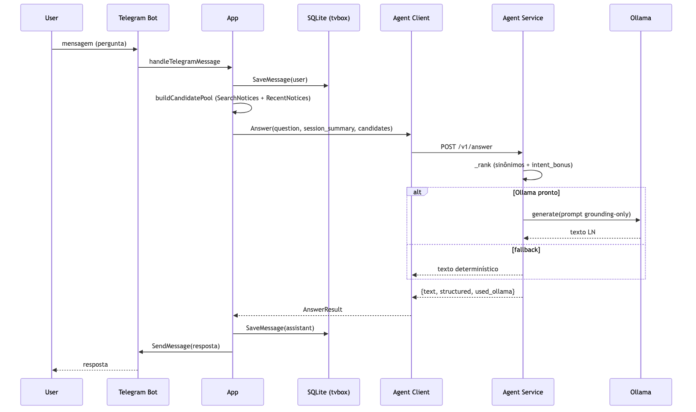
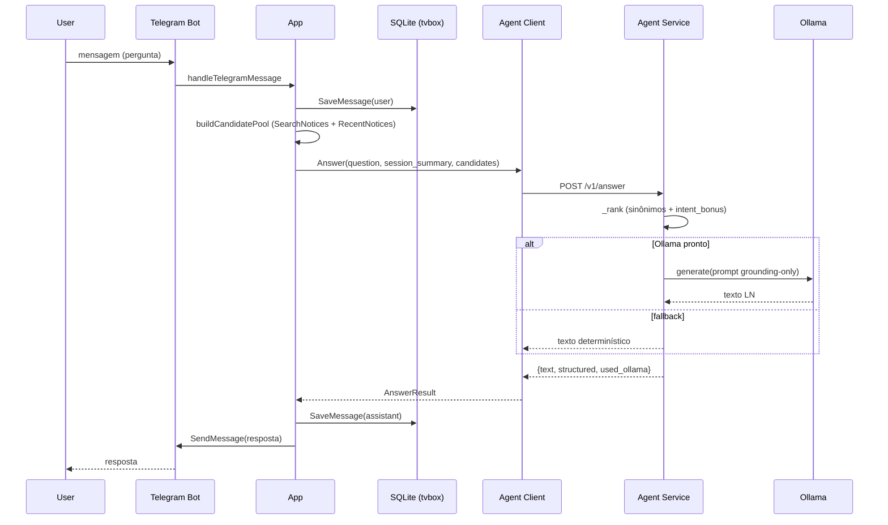

# Sequence Diagrams

## Workflow: Sincronização periódica (tvbox)

## Workflow: Consulta em linguagem natural (via Telegram)

## Walkthrough (consulta)

1. **Entrada** — [`tvbox/internal/telegram/bot.go`](../../tvbox/internal/telegram/bot.go) faz `getUpdates`; [`app.go:runTelegram`](../../tvbox/internal/app/app.go) consome.
2. **Roteamento** — [`app.go:handleTelegramMessage`](../../tvbox/internal/app/app.go) decide comando vs. consulta; consultas caem em `answerQuery`.
3. **Candidatos** — [`app.go:buildCandidatePool`](../../tvbox/internal/app/app.go) mistura busca textual (`SearchNotices`) e recentes (`RecentNotices`).
4. **Resposta** — [`agent/src/agent/service.py:AgentService.answer`](../../agent/src/agent/service.py) ranqueia e (se houver Ollama) gera texto com `_prompt` restrito aos candidatos.

## Notes

- Todo fallback de `answerQuery` devolve `formatNotices` (listagem textual) se o agente não retornar `Structured`.
- O push de ingestão é assíncrono em relação à consulta: a sincronização roda no scheduler e empurra delta; a consulta só lê o que já está indexado.
